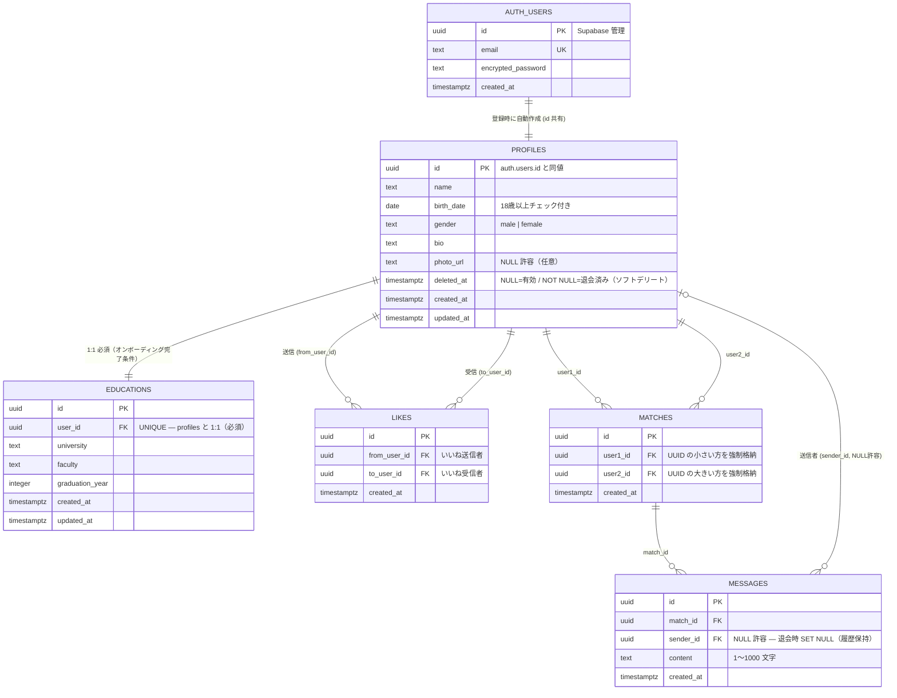

# データモデル — ER図

最終更新: 2026-05-14（矛盾修正: M-1 退会挙動・M-2 年齢フィールド・M-3 学歴必須化）

---

## ER図



---

## テーブル間の制約サマリ

| 関係 | カーディナリティ | 削除時の挙動 |
|---|---|---|
| auth.users → profiles | 1:1 | CASCADE（auth 削除で profile も削除）|
| profiles → educations | 1:1（必須） | CASCADE |
| profiles → likes (from) | 1:N | CASCADE |
| profiles → likes (to) | 1:N | CASCADE |
| profiles → matches (user1/user2) | 1:N | CASCADE |
| matches → messages | 1:N | CASCADE |
| profiles → messages (sender) | 1:N | **SET NULL**（退会後もメッセージ履歴を保持）|

---

## 解決済みの矛盾

### ✅ M-1: 退会時に相手のチャット履歴が消える問題 → ソフトデリートで解決

**修正内容:**
- `profiles` に `deleted_at timestamptz` を追加（ソフトデリート方式）
- `messages.sender_id` の FK を `ON DELETE SET NULL` に変更（nullable）
- 退会フロー: `deleted_at = now()` をセット → セッション無効化
- 退会ユーザーの profile レコードは残存。`deleted_at IS NOT NULL` のユーザーは探索・いいね一覧から除外
- UI: `sender_id = null` のメッセージは「退会済みユーザー」と表示

**RLS 変更点:**
```sql
-- 修正前
create policy "profiles: 全員が参照可能" on public.profiles for select using (true);

-- 修正後（退会済みユーザーは自分以外に見えない）
create policy "profiles: 有効ユーザーは全員が参照可能"
  on public.profiles for select
  using (deleted_at is null or auth.uid() = id);
```

---

### ✅ M-2: `age` が静的整数値 → `birth_date` に変更で解決

**修正内容:**
- `profiles.age integer` を `profiles.birth_date date` に変更
- DB チェック制約: `birth_date <= current_date - interval '18 years'`
- 年齢の取得は `profiles_with_age` ビュー経由（`age(birth_date)` で動的計算）

```sql
create or replace view public.profiles_with_age as
select *, date_part('year', age(birth_date))::integer as age
from public.profiles;
```

- 探索フィルター（S-2「年齢フィルター」）は birth_date の範囲変換でクエリ:

```sql
-- 「25〜30歳」でフィルタリングする場合
where birth_date between
  current_date - interval '30 years'
  and current_date - interval '25 years'
```

---

### ✅ M-3: 学歴の必須・任意が未定義 → 必須（アプリレベル強制）で解決

**修正内容:**
- 要件書 P-2 を「**必須項目**」として明記
- オンボーディング画面でプロフィール + 学歴を同時入力し、両方完了しないと `/discover` に進めない
- ER図上の関係を `0 or 1`（`||--o|`）から `1:1 必須`（`||--||`）に変更
- `educations` テーブルの構造変更は不要（DB は `user_id UNIQUE` のまま。強制はアプリ層で担保）

---

## 残存する未決定事項（🟡）

**[U-1] `likes` と `matches` の整合性**
マッチング成立後も `likes` レコードが残る。「いいね済みか」「マッチ済みか」を区別するには
`likes + matches` の JOIN が必要。`likes.is_matched boolean` の追加を将来検討。

**[U-2] 通知の永続化手段がない**
`matches.created_at` でマッチング日時はわかるが、通知既読状態を保存できない。
MVP では画面内バナーのみ（状態は React state で管理）。本格対応時は `notifications` テーブルを追加。

**[U-3] メッセージの既読状態がない**
未読件数の表示が構造上できない。MVP ではスコープ外と明示的に割り切る。

**[U-4] `matches` の user1/user2 割当ルール**
`check (user1_id < user2_id)` により OR 条件クエリが必須。
ユーザー数が増えた際のパフォーマンス劣化時に `match_members` 中間テーブルへの移行を検討。

**[U-5] `educations.id` が冗長**
`user_id` が UNIQUE かつ FK なので PK として十分。MVP ではこのまま維持し、
将来的に複数学歴対応（大学院など）が必要になった時点で見直す。

---

## 追加を検討すべきフィールド（将来）

| 対象 | 追加候補 | 理由 |
|---|---|---|
| `profiles` | `last_active_at timestamptz` | 探索一覧でのアクティブ順ソート |
| `messages` | `is_read boolean` | 未読メッセージ数の表示 |
| `likes` | `is_matched boolean` | マッチ済みいいねの区別 |
| *(新規)* | `notifications` テーブル | 通知既読管理の本格対応 |
