# ユーザーフロー図 — 学歴デート

最終更新: 2026-05-14

> `screens.md` の画面定義をもとに、主要シナリオの画面遷移を Mermaid で記述。
> 各シナリオは独立して読める。認証ガードによる自動リダイレクトは末尾の補足を参照。

---

## 凡例

| 記号 | 意味 |
|---|---|
| `([...])` | 開始 / 終了点 |
| `[...]` | 画面（SC-xx / OV-xx）|
| `{...}` | 分岐・判定 |
| `[[...]]` | システム処理（リダイレクト・自動判定）|
| `-->` | ユーザー操作による遷移 |
| `-.->` | システムによる自動遷移 |

---

## 全体遷移マップ

画面間の主要な接続を俯瞰する図。詳細フローは各シナリオを参照。

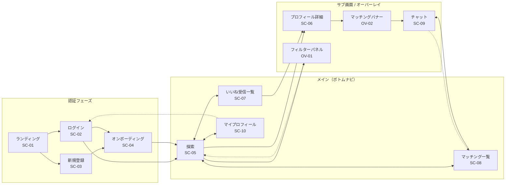

---

## シナリオ 1: 初回登録〜探索開始

**対象ユーザー:** アプリを初めて利用する新規ユーザー  
**カバー要件:** A-1 / P-1 / P-2 / P-4

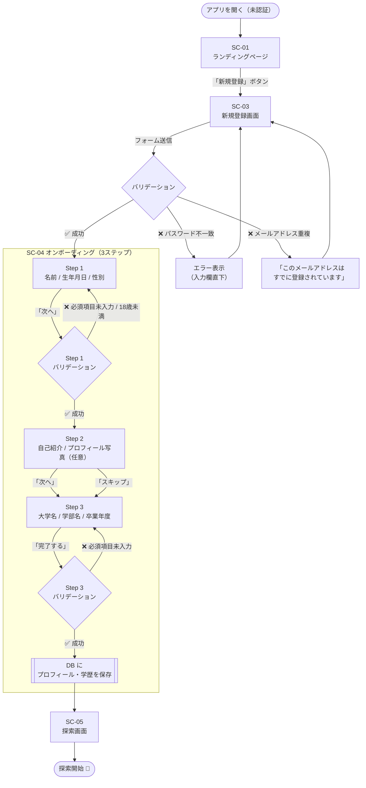

---

## シナリオ 2: 既存ユーザーのログイン

**対象ユーザー:** 登録済みのユーザー  
**カバー要件:** A-2 / A-4

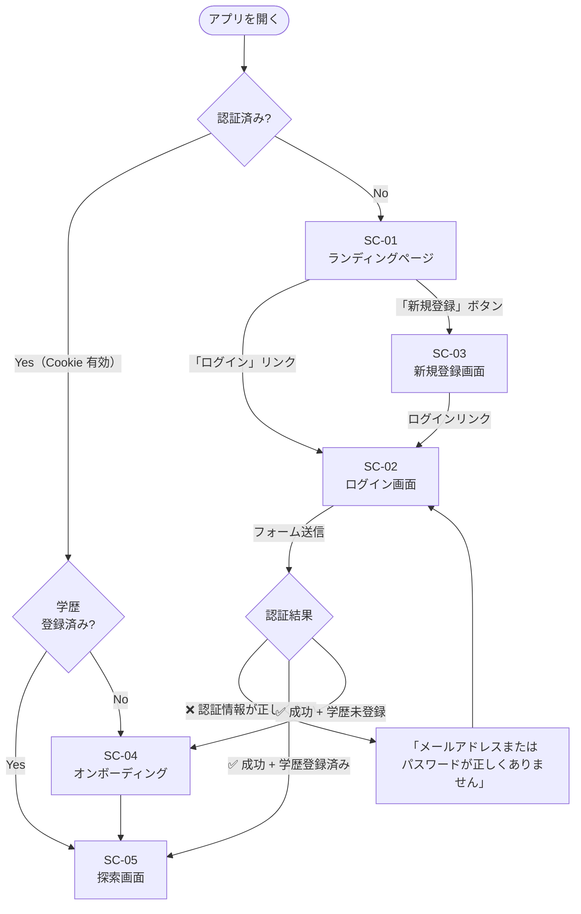

---

## シナリオ 3: 探索・いいね・マッチング成立

**対象ユーザー:** ログイン済みユーザーが相手を探していいねを送る  
**カバー要件:** S-1〜S-4 / L-1 / L-3 / M-1 / M-2

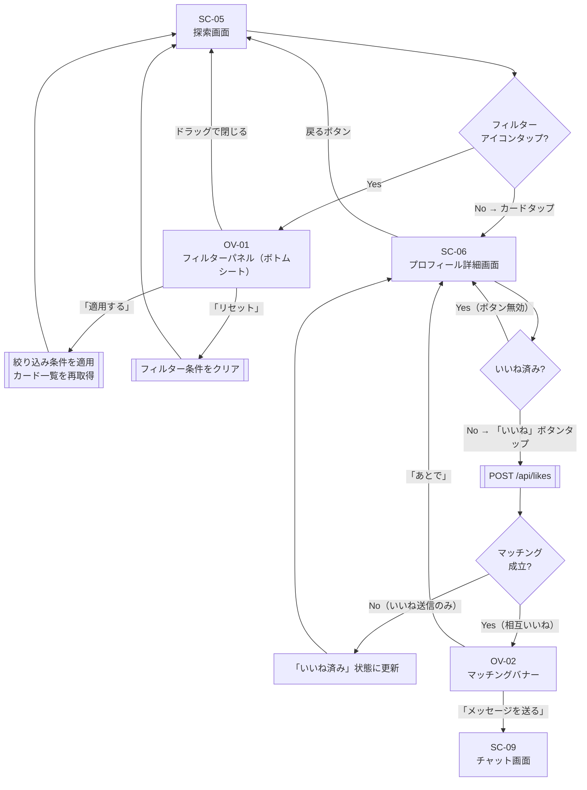

---

## シナリオ 4: いいね受信一覧からマッチング成立

**対象ユーザー:** 自分にいいねを送ってきた相手にいいね返しをしてマッチングする  
**カバー要件:** L-2 / M-1 / M-2

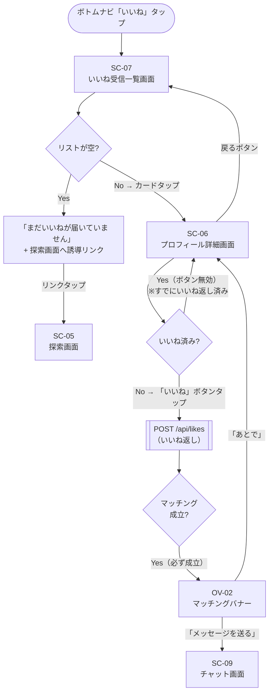

---

## シナリオ 5: マッチング一覧からのチャット

**対象ユーザー:** マッチング済みの相手とメッセージをやり取りする  
**カバー要件:** C-1〜C-4 / M-3

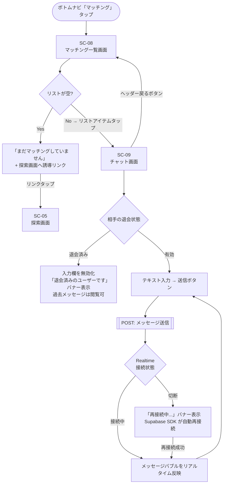

---

## シナリオ 6: プロフィール編集・退会

**対象ユーザー:** 自分のプロフィールを更新する / 退会する  
**カバー要件:** P-3 / P-4 / AC-1

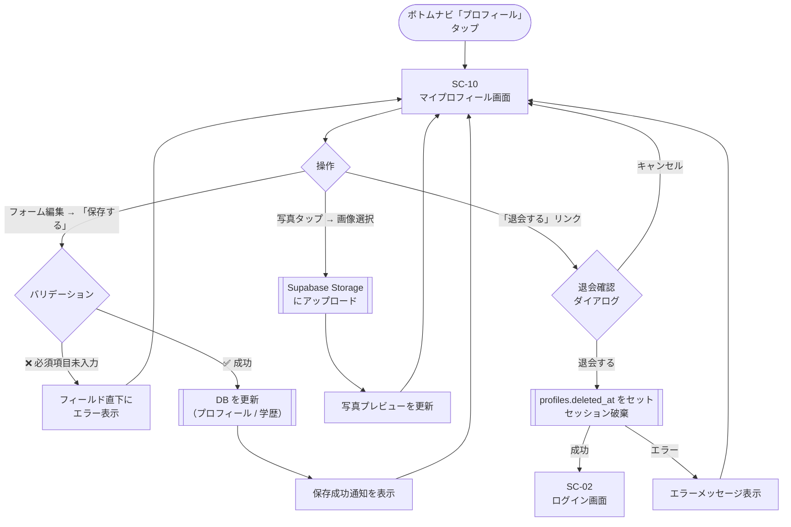

---

## シナリオ 7: エラー時の挙動

### 7-1. 一覧画面（探索 / いいね受信 / マッチング一覧）のロードエラー

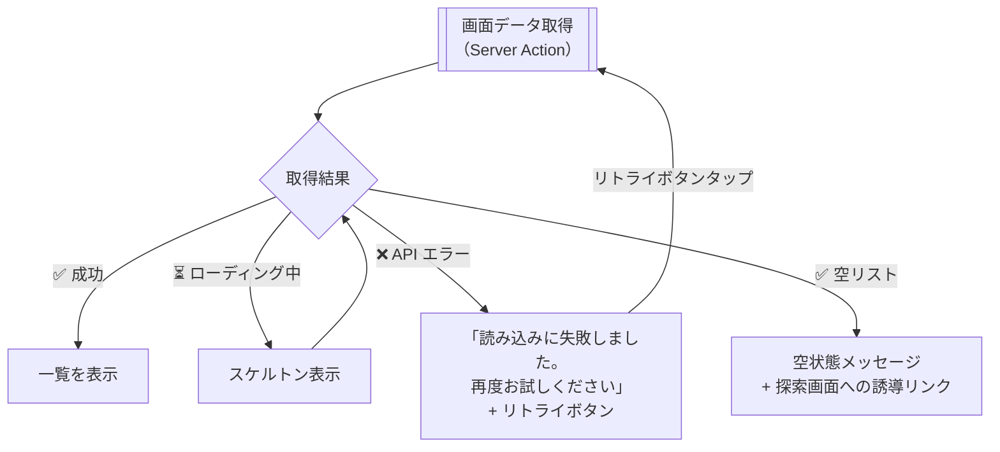

### 7-2. いいね送信エラー

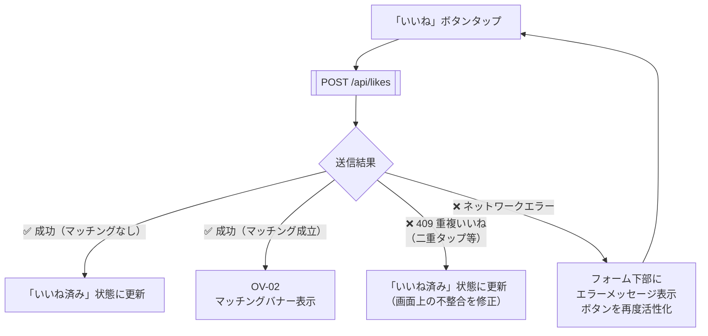

### 7-3. チャット送信エラー / Realtime 切断

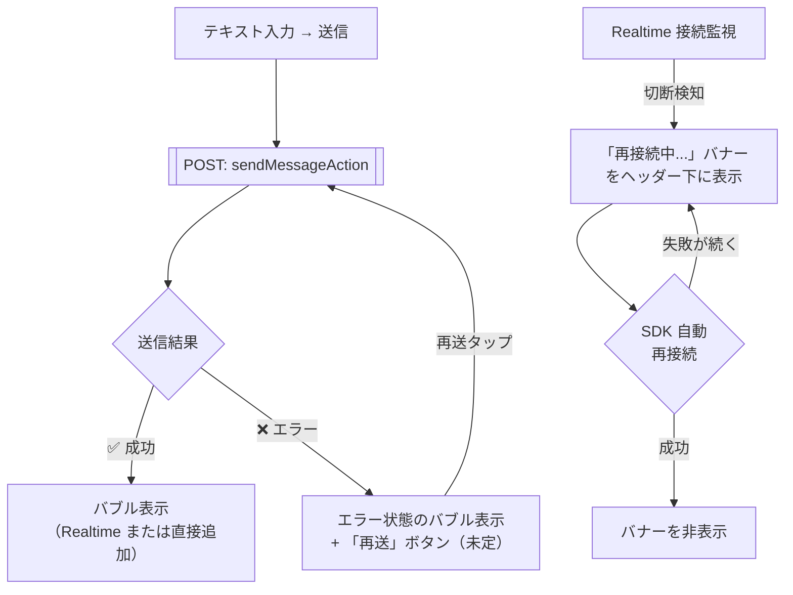

### 7-4. プロフィール詳細画面のロードエラー

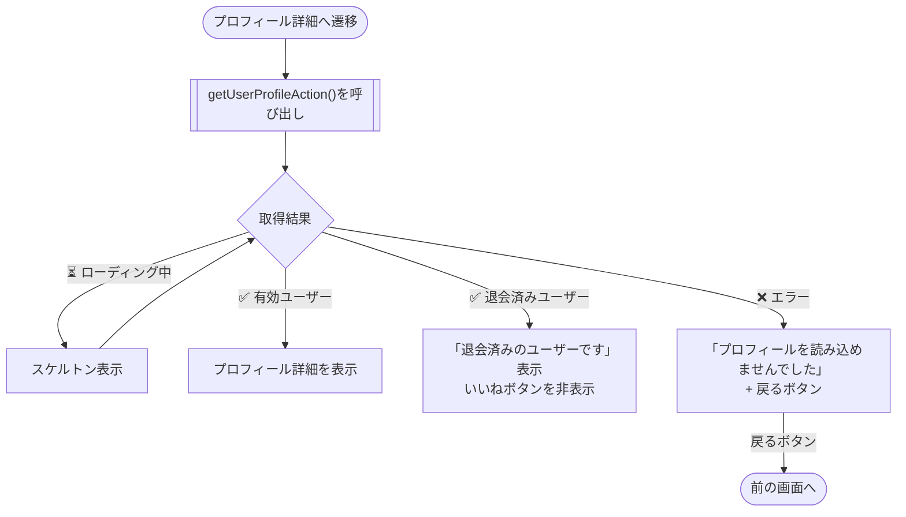

---

## 補足: 認証ガード（自動リダイレクト）

ミドルウェア（`middleware.ts`）と `(main)/layout.tsx` が自動的に実施するリダイレクトの一覧。

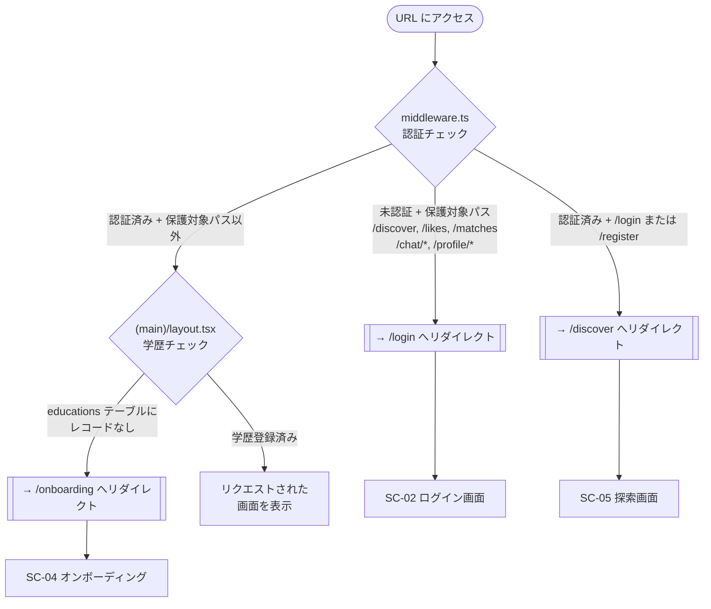

---

## 画面遷移の起点まとめ

| 起点 | 遷移先 | 条件 |
|---|---|---|
| ボトムナビ「探す」 | SC-05 探索 | 常に |
| ボトムナビ「いいね」 | SC-07 いいね受信一覧 | 常に |
| ボトムナビ「マッチング」 | SC-08 マッチング一覧 | 常に |
| ボトムナビ「プロフィール」 | SC-10 マイプロフィール | 常に |
| SC-05 カードタップ | SC-06 プロフィール詳細 | 常に |
| SC-07 カードタップ | SC-06 プロフィール詳細 | 常に |
| SC-06 いいねボタン → マッチング成立 | OV-02 マッチングバナー | 相互いいね時のみ |
| OV-02「メッセージを送る」 | SC-09 チャット | 常に |
| SC-08 リストアイテムタップ | SC-09 チャット | 常に |
| SC-10「退会する」→ 完了 | SC-02 ログイン | 退会処理成功時 |
| 未認証でメイン画面アクセス | SC-02 ログイン | middleware による自動 |
| 認証済みで学歴未登録 | SC-04 オンボーディング | layout.tsx による自動 |
